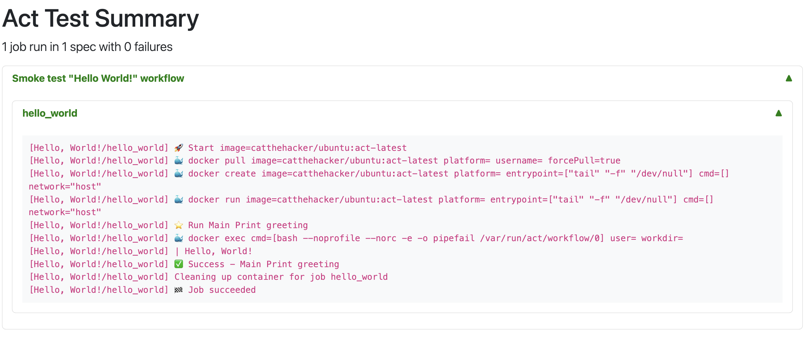

= Gradle Act Plugin

[.float-group]
--
[.left]
image::https://github.com/pshevche/gradle-act-plugin/actions/workflows/build.yml/badge.svg[link=https://github.com/pshevche/gradle-act-plugin/actions/workflows/build.yml]

[.left]
image::https://img.shields.io/maven-metadata/v/https/plugins.gradle.org/m2/io/github/pshevche/act/io.github.pshevche.act.gradle.plugin/maven-metadata.xml.svg?colorB=007ec6&label=Gradle Plugin Portal[https://plugins.gradle.org/plugin/io.github.pshevche.act]
--

**Provides a convenient wrapper plugin over the https://github.com/nektos/act[act] project.**

The plugin defines an opinionated specification format for validating GitHub workflows locally using the https://github.com/nektos/act[act] runner.

Configured validation tasks execute specified GitHub workflows according to the provided specifications and report essential details in a user-friendly format.

== Table of content

* <<getting_started, Getting started>>
** <<compatibility, Minimal supported versions>>
** <<apply_plugin, Apply plugin>>
** <<minimal_configuration, Minimal configuration>>
* <<specification_format, Specification format>>
* <<custom_task, Defining custom validation tasks>>
* <<reporting, Reporting>>
* <<limitations, Known limitations>>
* <<useful_links, Useful links>>

[[getting_started]]
== Getting started

[[compatibility]]
=== Minimal supported versions

Minimal supported Gradle version: `7.4`

Minimal supported Java version: `11`

[[apply_plugin]]
=== Apply plugin

_build.gradle.kts_

[source,kotlin]
----
plugins {
    id("io.github.pshevche.act") version "1.0"
}
----

[[minimal_configuration]]
=== Minimal configuration

. Configure default validation task using the project extension.

    act {
        // define the root directory containing GitHub workflows to be validated
        workflowsRoot = file(".github/workflows")
        // define the root directory containing test scenarios and resources
        specsRoot = file(".github/act")
    }

. Add a GitHub workflow YAML file to your workflows root.

    name: Hello, World!
    on: [ push ]
    jobs:
        hello_world:
        runs-on: ubuntu-latest
        steps:
            - name: Print greeting
              run: echo "Hello, World!"

. Add a specification `*.act.yaml` file describing how to execute your workflow

    # display name of the workflow to be used in reports
    name: Smoke test "Hello World!" workflow
    # path to the workflow file relative to the configure workflows root
    workflow: hello_world.yaml

. Run built-in `./gradlew actTest` task to execute provided specifications
. View generated XML and HTML reports under `build/reports/act/actTest` directory.

[[specification_format]]
== Specification format

[source,yaml]
----
# (required) display name of the workflow to be used in reports
name: string
# (required) path to the workflow file relative to the configure workflows root
workflow: string
# (optional) ID of the job to run in the specified workflow, default is all jobs
job: string
# (optional) configuration of the event to trigger the workflow with
event:
  # (optional) type of the event to trigger the workflow with
  type: string
  # (optional) path to a JSON file relative to the specs root containing the event payload
  payload: string
# (optional) environment variables to pass to the workflow execution
env:
  # (optional) a map of values to pass to the workflow
  values:
    key1: value1
    key2: value2
  # (optional) path to a .env file relative to the specs root containing key-value pairs
  file: string
# (optional) inputs for a manual workflow trigger
inputs:
  # (optional) a map of values to pass to the workflow
  values:
    key1: value1
    key2: value2
  # (optional) path to a .inputs file relative to the specs root containing key-value pairs
  file: string
# (optional) secret values to pass to the workflow execution
secrets:
  # (optional) a map of values to pass to the workflow
  values:
    key1: value1
    key2: value2
  # (optional) path to a .secrets file relative to the specs root containing key-value pairs
  file: string
# (optional) context variables to pass to the workflow execution
variables:
  # (optional) a map of values to pass to the workflow
  values:
    key1: value1
    key2: value2
  # (optional) path to a .variables file relative to the specs root containing key-value pairs
  file: string
# (optional) key-value pairs describing the matrix values to execute the workflow with
matrix:
  key1: value1
  key2: value2
# (optional) configuration of resources to configure for workflow execution
resources:
  # (optional) configuration of the artifact server to simulate workflow artifact upload
  artifactServer:
    # (required) describes whether the resource should be enabled
    enabled: boolean
    # (required) path to the local directory in which artifacts should be stored
    storage: string
    # (optional) address to which the server binds
    host: string
    # (optional) port to which the server binds
    port: int
  # (optional) configuration of the cache server to simulate workflow cache storage
  cacheServer:
    # (required) describes whether the resource should be enabled
    enabled: boolean
    # (required) path to the local directory in which cache entries should be stored
    storage: string
    # (optional) address to which the server binds
    host: string
    # (optional) port to which the server binds
    port: int
# (optional) additional arguments to pass to the act command as-is
additionalArgs:
  - string1
  - string2
----

[[custom_task]]
== Defining custom validations task

In addition to the default `actTest` task, custom validation tasks can be defined as follows:

_build.gradle.kts_

[source,kotlin]
----
import io.github.pshevche.act.ActTest

tasks.register<ActTest>("customActTest") {
    workflowsRoot = file(".github/customWorkflows")
    specsRoot = file(".github/customAct")
    forwardActOutput = true
    reportsDir = layout.buildDirectory.dir("customActTestReports")
}
----

[[reporting]]
== Reporting

In the configured reports directory, the task will generate two report files: `test.xml` and `test.html`:

* `test.xml`: a single XML file in an https://github.com/ota4j-team/open-test-reporting?tab=readme-ov-file#event-based-format[event-based Open Test Reporting format] containing results of all specifications.
* `test.html`: a human-readable HTML file containing results of all specifications.

[[limitations]]
== Known limitations

=== Sequential specification executions

Currently, `act` command has a state shared between invocations.
Invoking `act` in-parallel (e.g. to evaluate multiple specifications) may result in a polluted state and as a result flaky workflow executions.
To prevent this from happening, the default validation task has been designed to execute all specifications sequentially.
When adding a custom validation task, ensure that it does not run in-parallel with other `ActTest` tasks to prevent the polluted state.

=== Supported `act` options

`act` provides a large number of options to configure workflow execution.
This plugin aims to abstract away the configuration effort and enforce best practices.
Therefore, the initial release of the plugin has a built-in support for a small set of options deemed essential to design meaningful test scenarios for GitHub workflows.
Additional unsupported arguments can be passed using the `additionalArgs` property of a specification file.
Despite having this option, feel free to submit a feature request for a new option describing how the plugin and its users will contribute from having a native support for this property.

[[useful_links]]
== Useful links

* https://github.com/nektos/act[nektos/act]: GitHub actions runner used by the plugin.
* https://nektosact.com/[act User Guide]: describes various configuration options that the runner provides, as well as the format for input files.
* https://github.com/ota4j-team/open-test-reporting[Open Test Reporting format]: contains the schema for XML reports that can be referenced for automation development.
* https://plugins.gradle.org/plugin/io.github.pshevche.act[Gradle Act Plugin]: Gradle Act Plugin on Gradle Plugin Portal.